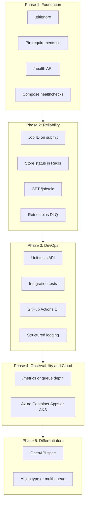

# Prioritized Roadmap

This document defines the **order of implementation** for turning the distributed job system into a resume-worthy project for a Solution Engineer (Cloud & AI Software) role. Phases are sequenced so that dependencies are satisfied before work that relies on them.

---

## Phase Flow

---

## Phase 1: Foundation (Do First)

| Item | Description |
|------|-------------|
| `.gitignore` | `__pycache__`, `*.pyc`, `.env`, `venv`, `.venv`, `.pytest_cache`, `*.egg-info`, `.DS_Store`. |
| Pin `requirements.txt` | Pin `flask`, `redis` in api and worker; add `pytest`, `pytest-cov`, `requests` when tests are added (Phase 3). |
| `GET /health` | API endpoint: `200` when Redis `PING` succeeds; `503` or `500` on failure. |
| Compose `healthcheck` | **api:** `curl` or `wget` to `http://localhost:5000/health`. **worker:** script that checks Redis (e.g., `redis-cli -h $REDIS_HOST PING`) or exits 0 if the process is up. |

**Why first:** Health and hygiene are needed for "production-like" demos and for any orchestrator (Compose, Container Apps, K8s). Pinned deps and `.gitignore` are required before a reliable CI pipeline.

---

## Phase 2: Reliability

| Item | Description |
|------|-------------|
| Job ID on submit | Generate UUID in `submit_job`; include in response and in the JSON enqueued to `job_queue`. |
| Store status in Redis | Worker writes `HSET job:<id> status completed|failed result <...>`. Set TTL or retention as needed. |
| `GET /jobs/:id` | Read from Redis; return `{ "id", "status", "task", "result"?, "created_at"? }` or `404`. |
| Retries + DLQ | Attempt counter in payload; on failure, re-`RPUSH` to `job_queue` until max (e.g., 3), then `RPUSH` to `dead_letter` (or `job_queue:dlq`). |

**Why second:** Status and retries are the natural next step after "it runs." They enable robust integration tests (poll `GET /jobs/:id` until `completed`) and DLQ demos for architecture discussions.

---

## Phase 3: DevOps

| Item | Description |
|------|-------------|
| Unit tests (API) | `POST /submit` (valid, invalid, missing `task`); `GET /health` (mocked Redis); `GET /jobs/:id` (mocked Redis) once it exists. |
| Integration tests | `docker compose up` (or `run`) + submit job + poll `GET /jobs/:id` until `completed` or timeout; optionally retry/DLQ path. |
| GitHub Actions CI | On push/PR: `pip install -r requirements.txt`, `pytest`, `docker compose build`; optionally `docker compose up` for integration. |
| Structured logging | Replace `print` in worker with a logger (JSON or key-value: `job_id`, `task`, `level`, `message`); add request logging in Flask (`job_id`, `status_code`, `path`). |

**Why third:** Tests and CI depend on health and job ID/status (Phase 1–2). They directly support "CI/CD" and "DevOps" in the job description.

---

## Phase 4: Observability and Cloud

| Item | Description |
|------|-------------|
| `/metrics` or queue depth | In-memory counters: `jobs_submitted`, `jobs_completed`, `jobs_failed`; `LLEN job_queue` for depth. Expose via `GET /metrics` (Prometheus-style) or minimal JSON. |
| Azure deployment | **Option A — Container Apps:** Compose or `az containerapp` for `api`, `worker`, Redis (or Azure Cache for Redis). **Option B — AKS:** Deployments + Services for `api`, `worker`, Redis. Add "Deploy to Azure" to README. |

**Why fourth:** Metrics and cloud deployment matter most once the app is reliable and tested. They complete the "cloud-native" and "scalable" story for interviews.

---

## Phase 5: Differentiators

| Item | Description |
|------|-------------|
| OpenAPI spec | `flask-openapi3`, `apispec`, or similar for `POST /submit`, `GET /jobs/:id`, `GET /health`, `GET /metrics`; Swagger UI; link from README. |
| AI job type or multi-queue | **(1) AI job type:** e.g., `{"type": "ai", "task": "summarize", "input": "..."}`; worker calls Azure AI / OpenAI-style API (or stub), stores result. **(2) Multi-queue / priority:** `job_queue:high` and `job_queue`; `BLPOP` with both keys for priority. |

**Why last:** These maximize "developer experience" and "AI/scale" without blocking the core roadmap. Choose one or both based on time and interview focus.

---

## Dependency Rules (Explicit)

- **Job ID and status store** are required before `GET /jobs/:id` and before robust integration tests (submit → poll until done).
- **`/health` and Compose `healthcheck`** are required before positioning for Azure or K8s (orchestrators need liveness/readiness).
- **Tests and pinned deps** are required before a meaningful CI pipeline (CI runs tests and expects reproducible installs).

---

## Resume and Interview Angles

| Topic | Where it shows up |
|-------|-------------------|
| **Cloud-native** | Containers, microservices, scaling (today); Azure deployment (Phase 4). |
| **DevOps / CI/CD** | GitHub Actions, tests, health checks, structured logging (Phases 1–3). |
| **Secure, scalable solution design** | Retries, DLQ, status, metrics, health (Phases 1–2, 4). |
| **APIs, containers, microservices** | REST API, OpenAPI (Phase 5), Docker, API vs. worker vs. Redis. |
| **AI** (optional) | AI job type or "AI-workload ready" narrative (Phase 5). |
